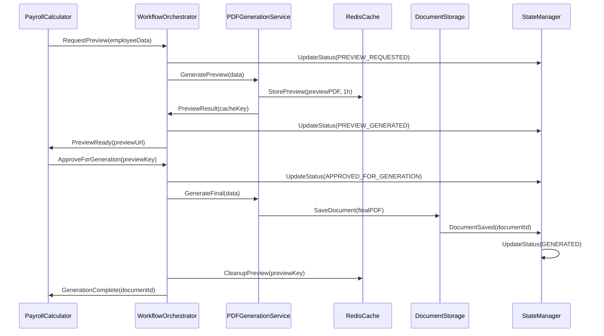

# PDF Payroll Bulletin System Architecture

## Executive Summary

This document outlines the comprehensive system architecture for implementing a robust PDF payroll bulletin generation workflow that addresses preview → save → status update pipeline requirements. The solution optimizes the existing React/Next.js/MongoDB stack while introducing hybrid storage, state management, and performance enhancements.

### Key Architectural Decisions
- **Hybrid Storage**: MongoDB for metadata, file system/cloud storage for PDFs
- **Dual Generation Mode**: Lightweight previews vs full-quality final documents  
- **State Machine**: Formal status transitions with audit trails
- **Async Processing**: Queue-based system for heavy operations
- **Redis Caching**: Performance optimization for frequently accessed documents

## Current System Assessment

### Existing Components Analysis
```typescript
// Current workflow identified:
BulletinPaieModal.tsx -> PDF preview via generateBulletinBlob()
PayrollCalculator.tsx -> Main workflow controller  
BulletinPaie.tsx -> PDF generation using @react-pdf/renderer
API endpoints -> /api/payroll/documents/* for persistence
```

### Critical Gaps Identified
1. **Preview Integration**: BulletinPaieModal exists but not integrated in main workflow
2. **Storage Inefficiency**: Base64 MongoDB storage (+33% overhead)
3. **State Management**: No formal status transition management
4. **Error Handling**: Basic error handling, no retry mechanisms
5. **Performance**: No caching, synchronous processing bottlenecks

## Proposed System Architecture

### Architecture Overview
```
┌─────────────────────────────────────────────────────────────┐
│                    Client Layer (React)                     │
├─────────────────────────────────────────────────────────────┤
│         PayrollCalculator → WorkflowOrchestrator             │
│              ↓                    ↓                        │
│      PreviewModal           DocumentGenerator               │
├─────────────────────────────────────────────────────────────┤
│                    API Gateway Layer                        │
├─────────────────────────────────────────────────────────────┤
│  PDFService │ StorageService │ StateService │ CacheService  │
├─────────────────────────────────────────────────────────────┤
│     MongoDB     │     File Storage     │     Redis Cache    │
└─────────────────────────────────────────────────────────────┘
```

### Core Service Architecture

#### 1. PDF Generation Service
```typescript
interface PDFGenerationService {
  generatePreview(data: PayrollData): Promise<PreviewResult>
  generateFinal(data: PayrollData): Promise<DocumentResult>
  
  // Configuration for different modes
  previewConfig: {
    quality: '72dpi'
    watermark: 'PREVIEW'
    reducedSections: boolean
  }
  
  finalConfig: {
    quality: '300dpi'
    fullContent: true
    digitalSignature: boolean
  }
}
```

#### 2. Document Storage Service
```typescript
interface DocumentStorageService {
  // Hybrid storage approach
  saveDocument(document: PDFDocument): Promise<DocumentMetadata>
  getDocument(documentId: string): Promise<DocumentBuffer>
  
  // Storage strategy
  metadata: 'mongodb'        // Fast queries, indexing
  files: 'filesystem'        // Efficient binary storage
  cache: 'redis'            // Fast retrieval
}
```

#### 3. State Management Service  
```typescript
interface StateManagementService {
  // Formal state machine
  transitionStatus(
    documentId: string, 
    from: PayrollStatus, 
    to: PayrollStatus,
    context: TransitionContext
  ): Promise<StatusTransition>
  
  // Status definitions
  states: [
    'CALCULATION_PENDING',
    'PREVIEW_REQUESTED', 
    'PREVIEW_GENERATED',
    'PENDING_APPROVAL',
    'APPROVED_FOR_GENERATION',
    'GENERATING',
    'GENERATED',
    'GENERATION_FAILED',
    'APPROVED',
    'SENT',
    'ARCHIVED'
  ]
}
```

## Data Flow Specifications

### Preview → Save → Status Workflow



### Document Storage Data Model

```typescript
// MongoDB Document Metadata
interface PayrollDocumentMetadata {
  _id: string
  employeeId: string
  periodId: string
  documentType: 'BULLETIN_PAIE' | 'ORDRE_VIREMENT' | 'CNSS_DECLARATION'
  
  // Status tracking
  status: PayrollStatus
  statusHistory: StatusTransition[]
  
  // File information
  fileInfo: {
    fileName: string
    filePath: string
    fileSize: number
    mimeType: string
    checksum: string
  }
  
  // Generation metadata
  generationInfo: {
    generatedAt: Date
    generatedBy: string
    generationMode: 'PREVIEW' | 'FINAL'
    processingTime: number
  }
  
  // Business context
  payrollData: {
    salaireBrut: number
    salaireNet: number
    deductions: DeductionBreakdown
    employerCharges: EmployerCharges
  }
  
  // Audit trail
  auditTrail: AuditEntry[]
  
  // Indexing for performance
  indexes: {
    employeeId: 1
    periodId: 1
    status: 1
    'generationInfo.generatedAt': -1
  }
}

// File System Storage Structure
/*
/payroll-documents/
  /{year}/
    /{month}/
      /{employeeId}/
        bulletin-{employeeId}-{period}-{timestamp}.pdf
        ordre-virement-{employeeId}-{period}-{timestamp}.pdf
*/
```

## API Endpoints Design

### Enhanced API Architecture

```typescript
// 1. Preview Generation Endpoint
POST /api/payroll/documents/preview
{
  employeeId: string
  periodId: string  
  payrollData: PayrollCalculation
}
Response: {
  previewId: string
  previewUrl: string
  expiresAt: Date
  status: 'PREVIEW_GENERATED'
}

// 2. Final Generation Endpoint
POST /api/payroll/documents/generate
{
  previewId: string
  approvalContext: ApprovalMetadata
}
Response: {
  documentId: string
  status: 'GENERATED'
  downloadUrl: string
  metadata: DocumentMetadata
}

// 3. Status Management Endpoint
PATCH /api/payroll/documents/{id}/status
{
  newStatus: PayrollStatus
  transitionReason: string
  metadata?: object
}
Response: {
  previousStatus: PayrollStatus
  newStatus: PayrollStatus
  transitionId: string
  timestamp: Date
}

// 4. Document Retrieval Endpoint
GET /api/payroll/documents/{id}
Query: ?mode=download|inline&format=pdf|metadata
Response: 
  - mode=download: Binary PDF stream
  - mode=inline: PDF for preview
  - format=metadata: Document information only

// 5. Batch Operations Endpoint  
POST /api/payroll/documents/batch
{
  operation: 'GENERATE_ALL' | 'STATUS_UPDATE' | 'CLEANUP'
  criteria: SelectionCriteria
  parameters: OperationParameters
}
Response: {
  jobId: string
  status: 'QUEUED' | 'PROCESSING' | 'COMPLETED'
  progress: BatchProgress
}
```

### API Error Handling Strategy

```typescript
interface APIErrorResponse {
  error: {
    code: string
    message: string
    details?: object
    recoveryActions?: string[]
  }
  requestId: string
  timestamp: Date
}

// Error Categories
const ErrorCodes = {
  PDF_GENERATION_FAILED: 'PDF_GEN_001',
  STORAGE_INSUFFICIENT: 'STORAGE_002', 
  VALIDATION_ERROR: 'VALIDATION_003',
  STATE_TRANSITION_INVALID: 'STATE_004',
  CACHE_UNAVAILABLE: 'CACHE_005'
}

// Recovery Actions
const RecoveryActions = {
  PDF_GEN_001: ['retry_with_reduced_quality', 'fallback_to_html'],
  STORAGE_002: ['cleanup_old_files', 'contact_administrator'],
  STATE_004: ['check_current_status', 'force_reset_if_authorized']
}
```

## State Management Strategy

### Status State Machine

```typescript
// State Transition Matrix
const validTransitions: Record<PayrollStatus, PayrollStatus[]> = {
  CALCULATION_PENDING: ['PREVIEW_REQUESTED'],
  PREVIEW_REQUESTED: ['PREVIEW_GENERATED', 'GENERATION_FAILED'],
  PREVIEW_GENERATED: ['PENDING_APPROVAL', 'APPROVED_FOR_GENERATION'],
  PENDING_APPROVAL: ['APPROVED_FOR_GENERATION', 'PREVIEW_REQUESTED'],
  APPROVED_FOR_GENERATION: ['GENERATING'],
  GENERATING: ['GENERATED', 'GENERATION_FAILED'],
  GENERATED: ['APPROVED', 'ARCHIVED'],
  GENERATION_FAILED: ['PREVIEW_REQUESTED', 'ARCHIVED'],
  APPROVED: ['SENT', 'ARCHIVED'],
  SENT: ['ARCHIVED'],
  ARCHIVED: [] // Terminal state
}

// State Machine Implementation
class PayrollStatusMachine {
  async transition(
    documentId: string,
    targetStatus: PayrollStatus,
    context: TransitionContext
  ): Promise<StatusTransition> {
    
    const currentStatus = await this.getCurrentStatus(documentId)
    
    // Validate transition
    if (!this.isValidTransition(currentStatus, targetStatus)) {
      throw new InvalidTransitionError(currentStatus, targetStatus)
    }
    
    // Execute pre-transition hooks
    await this.executePreTransitionHooks(currentStatus, targetStatus, context)
    
    // Update status with atomic operation
    const transition = await this.updateStatusAtomic(
      documentId, 
      currentStatus, 
      targetStatus, 
      context
    )
    
    // Execute post-transition hooks
    await this.executePostTransitionHooks(transition)
    
    return transition
  }
}
```

### Component State Management

```typescript
// React State Management with Zustand
interface PayrollDocumentStore {
  // Document state
  documents: Record<string, PayrollDocumentMetadata>
  activeDocument: string | null
  
  // Workflow state  
  currentStep: 'PREVIEW' | 'APPROVAL' | 'GENERATION' | 'COMPLETE'
  isGenerating: boolean
  error: string | null
  
  // Actions
  actions: {
    requestPreview: (data: PayrollData) => Promise<void>
    approveGeneration: (previewId: string) => Promise<void>
    updateDocumentStatus: (id: string, status: PayrollStatus) => Promise<void>
    clearError: () => void
  }
}

// React Query for API state management
const usePayrollDocument = (documentId: string) => {
  return useQuery({
    queryKey: ['payroll-document', documentId],
    queryFn: () => fetchDocumentMetadata(documentId),
    staleTime: 5 * 60 * 1000, // 5 minutes
    refetchInterval: (data) => data?.status === 'GENERATING' ? 2000 : false
  })
}
```

## Performance & Caching Strategy

### Redis Caching Architecture

```typescript
interface CachingStrategy {
  // Preview Cache (Temporary)
  previews: {
    keyPattern: 'preview:{employeeId}:{periodId}:{hash}'
    ttl: 3600 // 1 hour
    storage: 'redis-binary'
  }
  
  // Metadata Cache (Frequently accessed)
  metadata: {
    keyPattern: 'doc-meta:{documentId}'
    ttl: 86400 // 24 hours  
    storage: 'redis-json'
  }
  
  // Employee Data Cache (Session-based)
  employeeData: {
    keyPattern: 'employee:{employeeId}:{periodId}'
    ttl: 1800 // 30 minutes
    storage: 'redis-json'
  }
}

// Cache Implementation
class PayrollCacheService {
  // Preview caching with automatic cleanup
  async cachePreview(
    employeeId: string,
    periodId: string, 
    pdfBuffer: Buffer
  ): Promise<string> {
    const hash = this.generateHash(employeeId, periodId, Date.now())
    const key = `preview:${employeeId}:${periodId}:${hash}`
    
    await this.redis.setex(key, 3600, pdfBuffer)
    
    // Schedule cleanup of old previews for this employee/period
    await this.schedulePreviewCleanup(employeeId, periodId)
    
    return key
  }
  
  // Intelligent cache warming
  async warmCache(employeeIds: string[], periodId: string): Promise<void> {
    const promises = employeeIds.map(async (employeeId) => {
      const metadata = await this.getEmployeeMetadata(employeeId, periodId)
      const key = `employee:${employeeId}:${periodId}`
      await this.redis.setex(key, 1800, JSON.stringify(metadata))
    })
    
    await Promise.all(promises)
  }
}
```

### Performance Optimization Strategy

```typescript
// PDF Generation Optimization
interface PDFOptimizationConfig {
  preview: {
    resolution: 72, // DPI
    imageCompression: 0.7,
    fontSubsetting: true,
    excludeMetadata: true,
    watermark: 'APERÇU - NON OFFICIEL'
  },
  
  final: {
    resolution: 300, // DPI  
    imageCompression: 0.9,
    fontSubsetting: false,
    includeMetadata: true,
    digitalSignature: true
  }
}

// Async Processing with Bull Queue
class PDFProcessingQueue {
  async addPreviewJob(
    employeeData: PayrollData,
    priority: 'high' | 'normal' = 'normal'
  ): Promise<string> {
    const job = await this.previewQueue.add(
      'generate-preview',
      { employeeData },
      { 
        priority: priority === 'high' ? 10 : 5,
        attempts: 3,
        backoff: 'exponential',
        removeOnComplete: 10,
        removeOnFail: 5
      }
    )
    
    return job.id
  }
  
  async addFinalGenerationJob(
    previewId: string,
    approvalContext: ApprovalMetadata
  ): Promise<string> {
    const job = await this.finalQueue.add(
      'generate-final',
      { previewId, approvalContext },
      {
        priority: 20, // Higher priority for final generation
        attempts: 5,
        backoff: 'exponential',
        delay: 0
      }
    )
    
    return job.id
  }
}
```

## Error Handling & Recovery Mechanisms

### Comprehensive Error Strategy

```typescript
// Error Classification System
enum ErrorSeverity {
  LOW = 'low',           // Degraded performance, fallback available
  MEDIUM = 'medium',     // Feature unavailable, user action required  
  HIGH = 'high',         // Service disruption, immediate attention
  CRITICAL = 'critical'  // Data loss risk, system-wide impact
}

interface ErrorHandler {
  // PDF Generation Errors
  handlePDFGenerationError(error: PDFError): Promise<RecoveryAction> {
    switch(error.type) {
      case 'MEMORY_OVERFLOW':
        return this.retryWithReducedQuality(error.context)
      case 'TEMPLATE_CORRUPTION':
        return this.useBackupTemplate(error.context)
      case 'DATA_VALIDATION':
        return this.sanitizeAndRetry(error.context)
      default:
        return this.escalateToHumanReview(error)
    }
  }
  
  // Storage Errors
  handleStorageError(error: StorageError): Promise<RecoveryAction> {
    switch(error.type) {
      case 'DISK_FULL':
        return this.triggerCleanupAndRetry(error.context)
      case 'PERMISSION_DENIED':
        return this.useAlternativeStoragePath(error.context)
      case 'NETWORK_TIMEOUT':
        return this.retryWithBackoff(error.context)
      default:
        return this.notifyAdministrator(error)
    }
  }
}

// Circuit Breaker Pattern
class PayrollServiceCircuitBreaker {
  private failures = 0
  private lastFailureTime: Date | null = null
  private state: 'CLOSED' | 'OPEN' | 'HALF_OPEN' = 'CLOSED'
  
  async execute<T>(operation: () => Promise<T>): Promise<T> {
    if (this.state === 'OPEN') {
      if (this.shouldAttemptReset()) {
        this.state = 'HALF_OPEN'
      } else {
        throw new ServiceUnavailableError('Service temporarily unavailable')
      }
    }
    
    try {
      const result = await operation()
      this.onSuccess()
      return result
    } catch (error) {
      this.onFailure()
      throw error
    }
  }
}
```

### Retry Mechanisms

```typescript
// Exponential Backoff Retry Strategy
class RetryManager {
  async retryWithBackoff<T>(
    operation: () => Promise<T>,
    maxAttempts: number = 3,
    baseDelay: number = 1000
  ): Promise<T> {
    let lastError: Error
    
    for (let attempt = 1; attempt <= maxAttempts; attempt++) {
      try {
        return await operation()
      } catch (error) {
        lastError = error
        
        if (attempt === maxAttempts) {
          break
        }
        
        const delay = baseDelay * Math.pow(2, attempt - 1)
        await this.sleep(delay)
      }
    }
    
    throw new MaxRetriesExceededError(maxAttempts, lastError)
  }
}

// Graceful Degradation Strategies  
interface DegradationStrategies {
  // PDF Generation Fallbacks
  pdfGeneration: {
    primary: 'react-pdf-renderer',
    fallback1: 'puppeteer-html-to-pdf', 
    fallback2: 'server-side-template-generation',
    emergency: 'plain-html-export'
  }
  
  // Storage Fallbacks
  storage: {
    primary: 'local-file-system',
    fallback1: 'cloud-storage-s3',
    fallback2: 'mongodb-gridfs',
    emergency: 'base64-mongodb'
  }
  
  // Cache Fallbacks
  cache: {
    primary: 'redis-cluster',
    fallback1: 'single-redis-instance',
    fallback2: 'memory-cache',
    emergency: 'no-cache-direct-generation'
  }
}
```

## Implementation Phases

### Phase 1: Foundation Infrastructure (Weeks 1-3)

**Week 1: Core Services Setup**
```typescript
// Deliverables:
- Enhanced PDF Generation Service with preview/final modes
- Document Storage Service with hybrid approach  
- Redis caching infrastructure setup
- Basic error handling framework

// Technical Tasks:
□ Implement PDFGenerationService class
□ Setup Redis for caching layer
□ Create hybrid storage structure
□ Enhance API error handling
□ Write unit tests for core services
```

**Week 2: State Management System**
```typescript
// Deliverables:
- Formal status state machine implementation
- Database schema updates for audit trails
- Status transition validation and hooks
- API endpoints for status management

// Technical Tasks:  
□ Implement PayrollStatusMachine
□ Update MongoDB schemas with status tracking
□ Create status transition API endpoints
□ Add audit trail functionality
□ Integration tests for state transitions
```

**Week 3: API Gateway and Orchestration**
```typescript
// Deliverables:
- Workflow orchestration service
- Enhanced API endpoints for preview/generation
- Request/response validation middleware
- API documentation and testing

// Technical Tasks:
□ Create WorkflowOrchestrator service
□ Implement preview/generation API endpoints
□ Add validation middleware
□ Create API documentation
□ Performance testing of API endpoints
```

### Phase 2: Workflow Integration (Weeks 4-6)

**Week 4: Preview Workflow Integration**
```typescript
// Deliverables:
- Enhanced BulletinPaieModal with proper preview integration
- Preview generation and caching workflow
- User interface updates for preview approval
- Preview cleanup mechanisms

// Technical Tasks:
□ Integrate preview generation in PayrollCalculator
□ Update BulletinPaieModal for new workflow
□ Implement preview approval UI
□ Add preview cleanup scheduling
□ User acceptance testing for preview workflow
```

**Week 5: Final Generation Workflow**
```typescript
// Deliverables:
- Final PDF generation with approval workflow
- Document persistence and status updates
- Download and sharing functionality
- Notification system integration

// Technical Tasks:
□ Implement approval-to-generation workflow
□ Add document download functionality  
□ Integrate notification system
□ Update UI for generation status tracking
□ End-to-end testing of complete workflow
```

**Week 6: Batch Operations and Optimization**
```typescript
// Deliverables:
- Batch processing for multiple employees
- Performance optimizations and caching
- Queue management for heavy operations
- Monitoring and alerting system

// Technical Tasks:
□ Implement batch generation workflows
□ Add queue management for async operations
□ Performance optimization and caching
□ Setup monitoring and alerting
□ Load testing and performance validation
```

### Phase 3: Advanced Features and Monitoring (Weeks 7-8)

**Week 7: Error Handling and Recovery**
```typescript
// Deliverables:
- Comprehensive error handling system
- Retry mechanisms and circuit breakers
- Graceful degradation strategies
- Admin tools for error recovery

// Technical Tasks:
□ Implement comprehensive error handling
□ Add retry mechanisms and circuit breakers
□ Create admin tools for manual recovery
□ Setup error monitoring and alerting
□ Resilience testing and validation
```

**Week 8: Production Readiness and Documentation**
```typescript
// Deliverables:
- Production deployment configuration
- Complete system documentation
- Performance monitoring dashboards
- Training materials and handover

// Technical Tasks:
□ Production deployment configuration
□ Complete technical documentation
□ Setup monitoring dashboards
□ Create training materials
□ Final system validation and handover
```

## Technical Risk Assessment

### High-Risk Areas

**1. PDF Generation Performance (Risk Level: HIGH)**
```typescript
Risk: Large PDF generation causing memory overflow and timeouts
Impact: Service unavailability, poor user experience
Mitigation: 
- Implement streaming PDF generation
- Memory monitoring and limits
- Graceful degradation to lower quality
- Queue-based async processing
```

**2. Storage Scalability (Risk Level: MEDIUM)**
```typescript
Risk: Rapid growth in PDF storage requirements
Impact: Increased storage costs, performance degradation
Mitigation:
- Implement automatic archiving policies
- Compression algorithms for older documents
- Cloud storage integration for scalability
- Monitor storage usage and alerts
```

**3. State Consistency (Risk Level: HIGH)**
```typescript
Risk: Status inconsistencies between preview and final generation
Impact: Data integrity issues, confused user experience
Mitigation:
- Atomic status transitions with database transactions
- Comprehensive validation before state changes
- Audit trails for all status changes
- Regular consistency checks and alerts
```

**4. Cache Dependencies (Risk Level: MEDIUM)**
```typescript
Risk: Redis cache unavailability affecting preview functionality
Impact: Degraded preview experience, increased database load
Mitigation:
- Implement cache fallback strategies
- Monitor cache health and performance
- Automatic failover to backup cache instances
- Graceful degradation without cache
```

### Risk Mitigation Matrix

| Risk Category | Probability | Impact | Mitigation Strategy | Monitoring |
|---------------|-------------|--------|-------------------|------------|
| PDF Memory Overflow | Medium | High | Streaming generation, memory limits | Memory usage alerts |
| Storage Full | Low | High | Auto-cleanup, cloud backup | Storage capacity monitoring |
| State Corruption | Low | Critical | Atomic transactions, validation | Data consistency checks |
| Cache Failure | Medium | Medium | Fallback strategies | Cache health monitoring |
| API Rate Limiting | High | Medium | Queue management, throttling | Request rate monitoring |

### Success Metrics and KPIs

```typescript
interface SystemMetrics {
  performance: {
    previewGenerationTime: '< 2 seconds (95th percentile)'
    finalGenerationTime: '< 5 seconds (95th percentile)'
    systemAvailability: '> 99.9%'
    errorRate: '< 0.1%'
  }
  
  business: {
    userSatisfaction: '> 4.5/5 rating'
    documentAccuracy: '> 99.9%'
    processEfficiency: '80% reduction in manual steps'
    complianceAdherence: '100% regulatory compliance'
  }
  
  technical: {
    cacheHitRate: '> 85%'
    storageEfficiency: '70% reduction vs base64'
    apiResponseTime: '< 200ms (median)'
    systemResourceUsage: '< 80% capacity'
  }
}
```

This architecture provides a comprehensive foundation for implementing a robust, scalable, and efficient PDF payroll bulletin generation system that addresses all identified requirements while maintaining high performance and reliability standards.